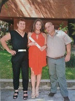
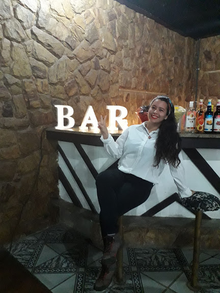

<!DOCTYPE html>
<html lang="pt-br">
<head>
    <meta charset="UTF-8">
    <title>Portafolio: Karliana Diaz</title>
</head>

<heder>
<header>

   <main>

        

            <h1>Meu nome é Karliana Diaz Flores:</h1> </header>
           
 Nasci na venezuela, mas já sou também um pouco carioca. 
             
            Sou uma mulher que gosta dos esportes radicais e sempre aprender coisas novas, entre mais adrenaline melhor.
 
            considero que sou uma pessoa muito criatividade com uma facilidade para me adaptar a qualquer entorno e adoro 
             ser uma funcionaria multi tarefas. 
            
 </heder>

  

            <h2>Historia de Vida</h2>

   
Nasci  um dia 16 de agosto de 1993 na Venezuela com a fortuna de ter pais maravilhoso. Tive muitos anos amenos  
                na Venezuela até que chegou a crises. Como o custo de vida aumentou de maneira brusca, ficou impossível continuar 
                 morando lá, na minha casa o dinheiro não alcançava para os mantimentos de toda minha família, isso partiu meu coração 
                  e me vi obrigada a emigrar.

               
 Com uma mala cheia de sonhos cheguei ao Rio de Janeiro onde após de 2 meses achei meu primer emprego e consecutivamente 
                    chegaram mais oportunidades.

                
Já se passaram 4 anos, muitas coisas mudaram na minha vida todo parar melhor. 

               
 Ainda falta muito por vivir,  vou construindo minha história com toda a liberdade para escolher quem eu quero ser. 
                 Não importa quais sejam as dificuldades ou as alegrias do caminho eu estou aproveitando esta oportunidade que me deu 
                  Deus no Brasil.

                

   

                

   <h2>Minhas experiências profissionais:</h2>
                    <lo>
                    <li>Na venezuela meu primeiro e unico trabalho foi de auxiliar administrativo no (Instituto Venezolano de investigaciones cientificar IVIC)</li>
                     <li>No brasil comencei sendo recepcionista  no Motel Dunas.</li>
                      <li>Atualmente sou auxiliar administrativo de umas das socias.</li>
                      <li>Bartender em eventos.</li>

  

   

                

                    <h2>Minhas formações:</h2>     
                  
 -Na Venezuela me formei em Administração de empresa.

                    
                            

            

                   
-Assistente de Rh pela Faetec.

                   

  
-Curso Basico de Bartender

  

   
-Curso de sobrevivencia na selva.

   
-Actualmente estou-me formando como desembolvedora Full stack com ajuda da startup social 
                        <a href="https://toti.site/#quem-somos"> TOTI</a>

                        
                

            
</main> 

<aside>
            

 <h2>Trabalhos Realizados no curso da TOTI</h2>

  
Te invito a conhecer meus trabalhos e ir acompnahando minha evolução no curso.

<ol>
    <ul> <h3>Conhecendo o Hit hub:</h3> Fiz meu primeiro repositorio te invito a dar uma olhada, faz um <a href="https://github.com/karlianadiaz/Curso_Git-1"> Click</a> </ul>
    <ul><h3> Apresentação feita no Hit hub sobre mim</h3> te invito a dar uma olhada, faz um <a href="https://karlianadiaz.github.io/"> Click</a> </ul>
    <ul><h3>Front-End (HTML)/ Elementos de multimidia </h3>Fiz minha primeira pagina, o tema é de uma trilha chamada pico do frade, te invito a dar uma olhada, faz um <a href="https://karlianadiaz.github.io/Pico-do-frade/"> Click</a> </ul>
    <ul><h3>Front-End (HTML)/ Agrupamento de elementos </h3>A ideia era conhecer as formas como uma pagina esta organizada, escolhi um tema e fiz um exemplo, te invito a dar uma olhada, faz um <a href="https://github.com/karlianadiaz/Exercicio-6-Elementos-de-Agrupamento"> Click</a> </ul>
    <ul><h3>Portafolio:</h3> Projeto ainda em adamento mas estou usando de inspiração o seguinte portafolio <a href="https://prashantsani.com"> Click</a> </ul>

</ol>

        

</aside>

<article>
<section area-label="coisas sobre mim"></section><h2>Coisas Interesantes sobre mim</h2>
<lu>
    <li>Amo fazer trilhas, vem e conhece minhas trilhas feitas</li>
    <li>Sou mãe e de gemêos, vamos bater um papo sobre maternidade?</li>
    <li>Gosto criar novos Drink e bebidas, queres saber mais?</li>
    <li>frases inspiradoras que eu gosto</li>
</lu>
</setion>
</article>
<nav>

<h2>Redes socias</h2>

    -Instagram <a href="https://www.instagram.com/karli.diazf/">click</a>

   
-Facebook <a href="https://www.facebook.com/karli1661">click</a>

</nav>

<section>

   O que determina quem eu sou é minha vontade de continuar lutando. Não vou desistir porque tive uma segunda chance de viver.”
  

   

</section>

 <footer> 
    <lu>
        <li><strong>Telefono:</strong> +55 (21)965023199</li>
        <li><strong>E-mail:</strong>karlianadiaz1661@gmail.com</li>
        <li><strong>Endereço:</strong> Muzema, Rio de Janeiro, RJ</li>
</lu>

  
 &copy;2020 Karliana Diaz 

  </footer>

</html>

